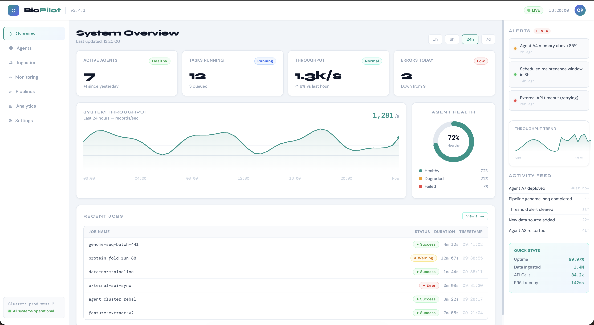

# BioPilot



BioPilot is a dashboard and orchestration project for biological data pipelines.

Quick links:

- Overview: simple system status dashboard with KPIs, throughput chart, and recent jobs.

How to view locally:

```bash
# from the repo root
cd BioPilot
# open the image in your default viewer on macOS
open img/biopilot.png
```

Notes:

- The snapshot image is stored at `img/biopilot.png`.
- Use placeholder/sample data only when sharing screenshots publicly.
